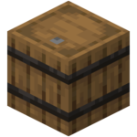
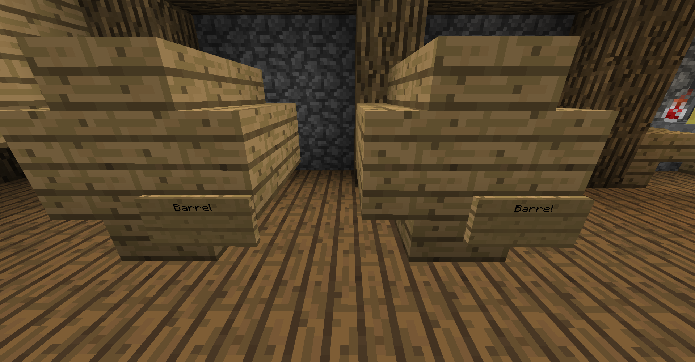

Advanced-Kind features Brewery, a plugin that adds an extra challenge to the towny experience; being able to walk in a straight line. 
It allows players to:

 - Master the brewing of alcoholic drinks.
- Experience what it's like to be drunk in Minecraft.
- Regret their decisions in the morning.

Unfortunately, cracking open a cold one takes more than just a trip to your local pub.
Keep in mind that:
- Brewing can only be done within towns.
- Depending on the recipe, the process may be more or less difficult/time consuming.
- The following instructions describe the common procedure.

---
## Getting Started
### Fermentation
The first step to becoming a master brewer is to **FERMENT** your ingredients.
1. Place a cauldron over a fire or other heat source.
2. Fill it with water.
3. Add your ingredients by right clicking.
4. Wait a few minutes while they ferment.
5. Fill your glass bottles.

:::tip
Use a clock on a cauldron, if you want to know the time the ingredients have been fermenting.
:::

### Distillation
The next is to **DISTILL** your previous bottles.
1. Put the bottle with ferment into a brewing stand.
1. Put glowstone dust as a filter into the brewing stand.

### Aging
Cheers, you've made it to the final step; **AGING**. 
To do this, you'll need a barrel.
- Depending on its size, you can age more or less bottles at a time. 
- After creating your barrel, simply but the brews inside.
- Be patient for the brews to complete!

There are multiple different barrels that can be used for the aforementioned.
Keep in mind:
- Depending on the recipe, the type of wood used for building the barrel may alter the quality of the aged brew. 
- The barrel should not be destroyed while aging, as it would leak the brews.

#### Barrel Sizes:
Small: Minecraft 1.14 Barrel

Medium: 8 Wooden Stairs

Big: 5 fences, 16 wooden stairs, 18 wooden planks

---

## Recipes
It's time to try the various concoctions Advanced-Kind has to offer! Bottoms up!

:::note
Information that is substituted with question marks is up to the player to discover. Hints are in both the name and the effects of said brew.
:::

### Miner Rum
Ingredients:
1. 2x (?)
2. 8x Redstone
3. 1x (?)

Cook Time: 5-25 mins

Distill Runs: (?)

Age: 20-35 years

Wood Type: (?)

Effects:
1. Haste 1-2 (5 mins)
2. Fire Resistance (5 mins)
3. Night Vision (5 mins)

### Azyrian Wine
Ingredients:
1. 6x Sweet Berries
2. 1x (?)
3. 3x (?)

Cook Time: 1-20 mins

Distill Runs: (?)

Age: 10-20 years

Wood Type: (?)

Effects:
1. Jump Boost (5 mins)
2. Speed 1-2 (5 mins)

### Arctic Spirit
Ingredients:
1. 3x (?)
2. 7x Sugar Cane
3. 1x (?)

Cook Time: 5-10 mins

Distill Runs: (?)

Age: 15-30 years

Wood Type: (?)

Effects:
1. Instant Healing 1-2
2. Absorption 2-4 (5 mins)
3. Regeneration 1-2 (5 mins)

### Imperial Tea
Ingredients:
1. 8x (?)
2. 9x Emeralds
3. 4x (?)

Cook Time: 10-50 mins

Distill Runs: (?)

Effects:
1. Speed 1-2 (5 mins)
2. Regeneration 1-2 (5 mins)
3. Strength 1-2 (5 mins)

### Eggnog
Ingredients:
1. (?)x Egg(s)
2. 8x Sugar
3. 3x (?)

Cook Time: 25-40 mins

Age: 1-5 years

Wood Type: (?)

Effects:
1. Regeneration 1-2 (?)

### Expresso
Ingredients:
1. (?)x Cocoa Beans
2. 5x Sugar

Cook Time: 10-30 mins

Effects:
1. Speed 1-2 (?)

### Lemonade

Ingredients:
1. 10x Yellow_Dye
2. 5x Sugar
3. 1x Water Bucket

Cooking Time: ?

Distill Runs: ?

Effects:
1. Speed 1-2 for 100 Seconds

### Lucky Brew

Ingredients:
1. 20x Sugar
2. 3x Water_Bucket
3. 3x ?

Distill Runs: ?

Cooking time: 3 hours

Wood: Any

Age: ?

Effects:
1. Luck (2 Minutes)

### Hot Cocoa

Ingredients:
1. 5x Sugar
2. 3x Milk-Bucket
3. 5x Cocoa Beans

Cooking Time: 1 Hour

Effects:
1. Speed 1-2 (60 Seconds)
2. Night Vision (60 Seconds)

### Please Don't

1. 32x ?
2. 64x Sweet Berries
3. 64x ?

Cooking Time: ?

Distill Runs: ?

Effects:
1. Poison 1 (60 Seconds)
2. Harming 2 (?)
3. Wither 1 (40 Seconds)
4. Regeneration 1 (60 Seconds)
5. Health Boost 1-3 (30 Seconds)
