On ADK, we have some custom recipes implemented to help out our gameplay. These mainly include work arounds for things that have been removed from the game on the server (ie. no villagers or custom terrain). Below is a list of the recipes that you can use on the server.

---

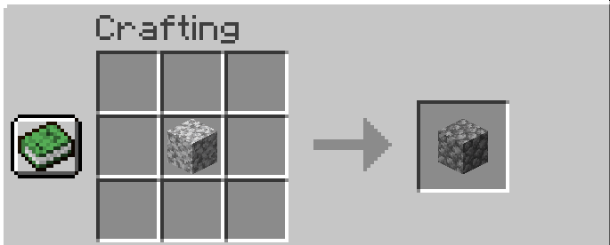
Now you can craft diorite into cobblestone!

---

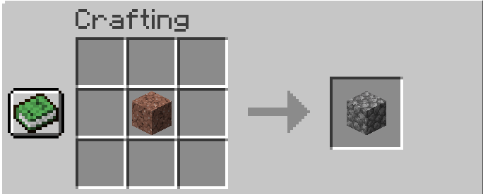
Now you can craft granite into cobblestone!

---

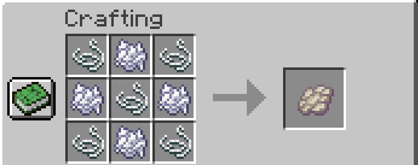
Since phantom's are disabled, now you can craft their membranes for fixing your elytras

---

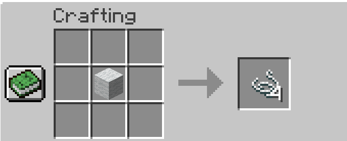
Now you can craft string from wool, because who doesn't hate that it doesn't go both ways.

---

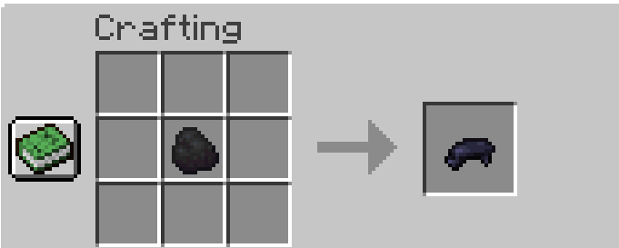
Coal can now be crafted into black dye because squids are so annoying to find.

---

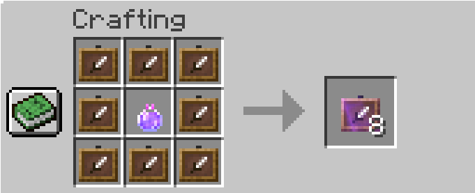
With the invisible item frame crafting perk, you can craft frames that turn invisible when something is placed in them.

---

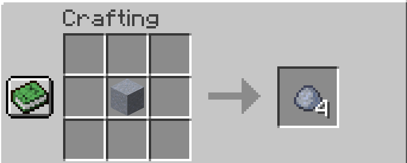
Just like the wool, you can craft clay blocks into clay balls, because this should be in minecraft by default.

---

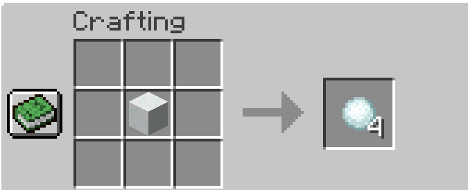
Same as the clay, snow to snowballs should be in the game by default

---

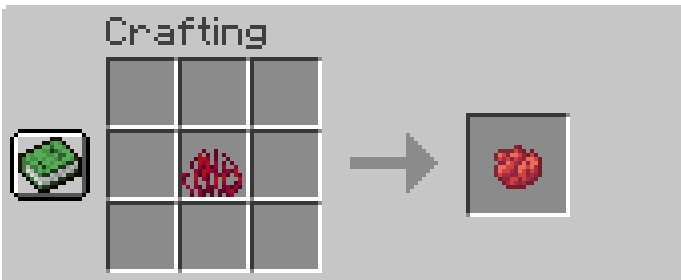
The new nether flowers can finally make dye just like all the others

---

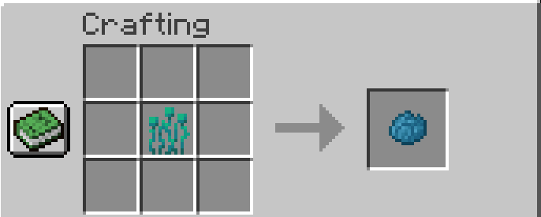
The new nether flowers can finally make dye just like all the others

---

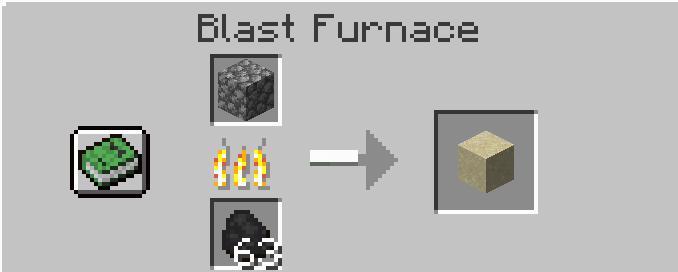
You can now smelt cobble into sand

---

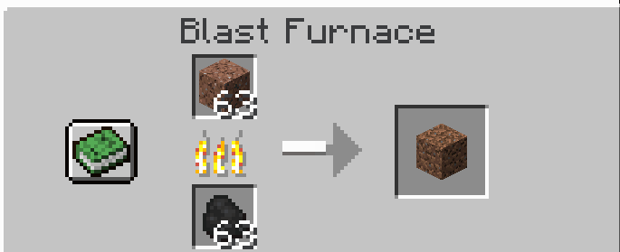
you can now smelt granite into dirt

---

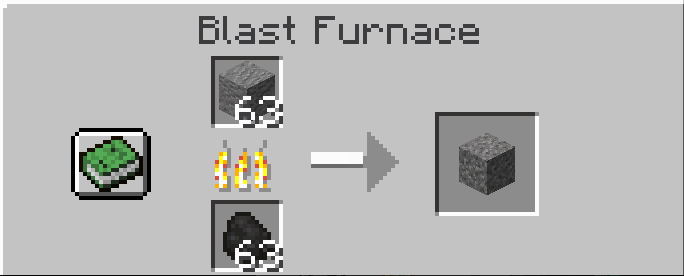
you can now smelt andesite into gravel

---

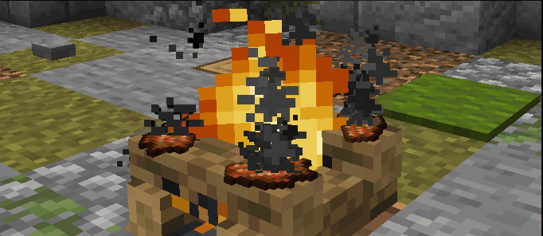

Roasting rotten flesh over a campfire will produce bones

---

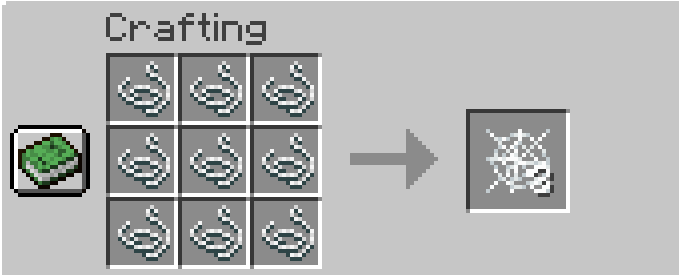
You can now craft cobwebs with string, for all the fancy builds your heart desires

---

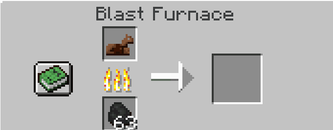
Horse armors can now be smelted into their material for those less equestrian 

---

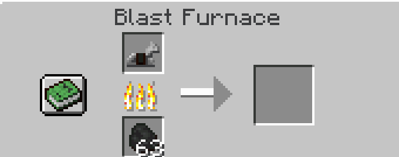
Horse armors can now be smelted into their material for those less equestrian 

---

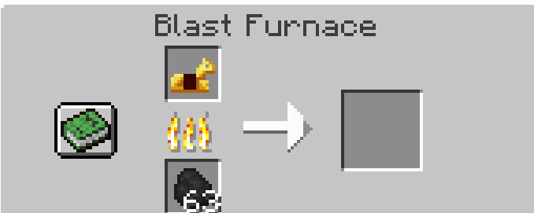
Horse armors can now be smelted into their material for those less equestrian 

---

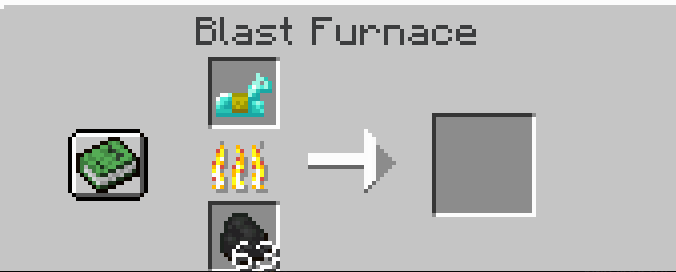
Horse armors can now be smelted into their material for those less equestrian 

---

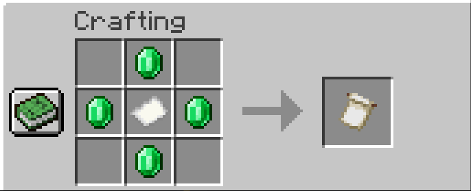
You can craft the globe pattern with emeralds since villagers were disabled.

---

---

---

