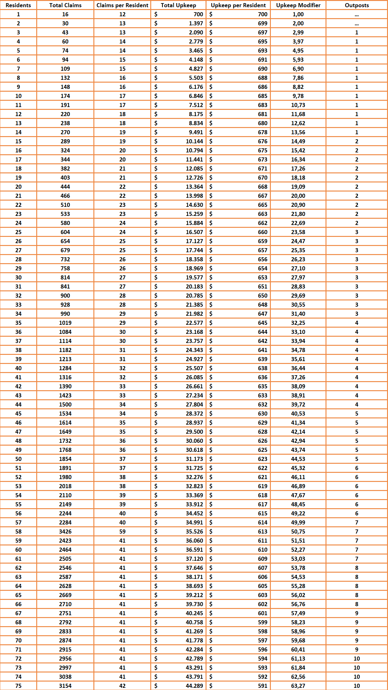

ADK's main plugin for protection of grief is the Towny plugin, a popular plugin that allows claiming of land, and teamwork between players.

---

## Why Have a Town?
There are plenty of benefits to joining a town over just living in the wild, so we wanted to list a few of the reasons why you may want to consider creating or joining a town:

- Extra grief protection - players cannot break or steal from areas claimed in a town
- Working with others - with towns, you can play with other players and enjoy the benefits of working together
- RPG - Towns provide a unique place to role play to your heart's content
- Mines and Brewery - two plugins of ADK that work specifically in towns and add a bunch of features to the game that you wont want to miss out on.

---

## Town Upkeep
One of the customizations ADK has is the economic impact of towns. In order to stay running, towns must pay their daily upkeep which is determined by player count. This chart explains the configuration we use:

---
## Town Ranks
Towny provides different ranks a mayor can give to their residents, giving them perms to help out around the town. These ranks and their permissions are as follows:

- Mayor - Owner of the town, has full control and access to all commands
- Co-Mayor - Similar to mayor, has access to all commands **except** selecting a new mayor or deleting the town
- Manager - Has full control over plot types and plot management/claiming.
- Recruiter - Has permissions to recruit players to the town and put plots up for sale
- Sheriff - Can add outlaws and send residents to jail
- Architect - Can build in all plots claimed by the town
- Worker - Can only build in public plots, no resident-claimed plots like the Architect
- Exempt - Not affected by town taxes

---

## ADK Towny
ADK has some special plugins and features that affect towny in ways you wont see on any other server. With the customization of upkeep and ranks, and the addition of plugins like Mines and Brewery, there are endless options for what you can do in a town

---

## Towny Commands

Here is a list of all the commands you may need when using towny. The list looks long, but its a big plugin and you likely wont need to use all of these commands, and you'll get used to using the plugin in no time.

### /towny
-  Shows basic towny commands.
-   ? - Shows more towny commands.
-   farmblocks - Shows the blocks usable in farm plots.
-   itemuse - Shows the items in the item_use_ids list.
-   map - Shows the towny map.
-   plotclearblocks - Shows the blocks deleted using `/plot clear`
-   prices - Shows taxes/costs associated with running a town.
-   switches - Shows the blocks in the switch_ids list.
-   time - Shows time until next new-day (tax/upkeep collection.)
-   top
    -   residents {all/town/nation} - Shows top residents.
    -   land {all/resident/town} - Shows top land owners.
-   spy - Admin command to spy on all chat channels
-   tree - Shows lots of stuff.
-   universe - Shows full towny stats, resident/town/nation/world counts as well as townblocks claimed.
-   v - Shows towny version.
-   war
    -   stats
    -   scores
    -   hud
    -   participants {page #}
-   wildsblocks - Shows the blocks that are usable in wilds plots, and which are allowed to be farmed in the wilderness.

### /plot
- Shows the /plot commands.
-   claim - Resident command to personally claims a plot that are for sale.
    -   auto - Resident command to personally claim an area of plots that are for sale, around the player typing the command.
-   unclaim - Resident command to unclaim personally owned plots.
    -   circle/rect - Resident command to unclaim personally owned plots in a circle or rectangle shape.
        -   {# (radius around current position)} - Radius of the area to unclaim.
-   {forsale/fs} - Set a plot for sale.
    -   circle/rect - Set a shape.
        -   {# (radius around current position)} - Radius of the area to set forsale.
    -   $$ - Cost of plot.
        -   circle/rect - Set a shape.
            -   {# (radius around current position)} - Radius of the area to set forsale.
-   {notforsale/nfs} - Set a plot to not be for sale.
    -   circle/rect - Set a shape.
        -   {# (radius around current position)} - Radius of the area to set notforsale.
-   evict - Used to remove a plot from a plot owner, usually by the mayor or assistant.
-   perm - Shows the perm line of the plot in which the player stands.
-   perm hud - Toggles on/off the plot perm hud scoreboard which shows the perm line of the plot in which the player stands along with more useful plot info.
-   set
    -   reset - Sets a shop/embassy/arena/wilds plot back to a normal plot.
    -   shop - Sets a plot to a shop plot.
    -   embassy - Sets a plot to an embassy plot.
    -   arena - Sets a plot to an arena plot.
    -   wilds - Sets a plot to a wilds plot.
    -   inn - Set a plot to an inn plot.
    -   jail - Set a plot to an jail plot.
    -   farm - Set a plot to a farm plot.
    -   bank - Set a plot to a bank plot.
    -   outpost - Set a plot to an outpost plot, costs the same as /t claim outpost.
    -   name - allows a mayor or plot-owner to rename plots they own, overwriting the ~Unowned message. Personal-plots display both the plot's given name and the name of the plot-owner.
    -   perm
        -   {on/off} - Edits the perm line of the single plot in which the player is standing. [See here for details.](https://github.com/TownyAdvanced/Towny/wiki/How-Towny-Works#towny-plot-perms)
        -   {resident/ally/outsider} {on/off}
        -   {build/destroy/switch/itemuse} {on/off}
        -   {resident/ally/outsider} {build/destroy/switch/itemuse} {on/off}
        -   reset - Resets the plot in which you stand to the default perm line of the /town or /resident screen (depending on if the plot is owned personally or by the town.)

-   toggle
    -   fire - Turn on/off firespread in the plot in which you stand.
    -   pvp - Turn on/off pvp in the plot in which you stand.
    -   explosion - Turn on/off explosions in the plot in which you stand.
    -   mob - Turn on/off hostile mobspawning in the plot in which you stand.
-   clear - Command to remove list of block id's from a plot, used by a mayor on town-owned land, or by a plot-owner on their personal plots.
-   group
    -   add|new|create {groupname} - Creates a plot group where a player is standing, also adds plots to an existing group.
    -   remove - Removes the plot stood in from its plot group.
    -   rename {newname} - Renames a plot group.
    -   set {plottype} - Sets the group to a specified plot type. Not able to be used for Jail plots.
    -   set perm ... - Used to set the perm line of the group you are standing in. See above section for /plot set perm for remainder of commands.
    -   toggle ... - Used to toggle plot settings. See above section for /plot set toggle for remainder of commands.
    -   forsale|fs {price} - Set the group for sale at the set price.
    -   notforsale|nfs - Set the group not for sale.

### /resident

-   Shows a player their resident screen.
-   ? - Shows /res commands available.
-   {resident} - Shows a player another player's resident screen.
-   friend
    -   add {resident} .. {resident} - Resident adds online player to their friends list.
    -   add+ {resident} .. {resident} - Resident adds offline player to their friends list.
    -   remove {resident} .. {resident} - Resident removes online player from their friends list.
    -   remove+ {resident} .. {resident} - Resident removes offline player from their friends list.
    -   clearlist - Removes all friends from a resident's friend list.
    -   list - Returns a list of your friends.
-   list - Lists residents in towny's data folder who are online.
-   jail paybail - Allows a player to pay to get out of jail. Funds go to the town which owns the Jail.
-   spawn - If deny_bed_use: true and player has a current bed spawn, command will teleport player to their bed.
-   toggle
    -   map - Turns on map which refreshes when moving across plot borders.
    -   townclaim - Turns on mode where /town claim is automatically used when moving across plot borders.
    -   plotborder - Turns on smokey plot-border view. Border shows when players cross to different townblocks.
    -   constantplotborder - Turns on smokey plot-border view. Border doesn't disappear.
    -   spy - Admins can turn on chat-channel spying.
    -   ignoreplots - Turns on/off plot notifications in town.
    -   reset - This turns off all modes that are active.
-   set
    -   perm
        -   {on/off} - Edits the perm line on the resident screen. [See here for details.](https://github.com/TownyAdvanced/Towny/wiki/How-Towny-Works#towny-plot-perms)
        -   {friend/ally/outsider} {on/off}
        -   {build/destroy/switch/itemuse} {on/off}
        -   {friend/ally/outsider} {build/destroy/switch/itemuse} {on/off}
        -   reset - This takes the perm line seen in the /resident screen and applies it to all plots personally owned by the player typing it.
-   tax - Shows taxes a player pays.

### /town
- Shows a player their town's town screen.
-   ? - Shows /town commands available.
-   {town} - Shows a player another town's town screen.
-   here - Shows you the town screen of the town in which you stand.
-   leave - Leaves a town.
-   list
    - by name {page #} - order alpabetically.
    - by resident {page #} - order by town with most residents.
    - by balance {page #} - order by town with the highest nation bank balance.
    - by townblocks {page #} - order towns by how many townblocks they have claimed.
    - by online {page #} - order by how many players are online at that moment.
    - by open {page #} - lists open towns first, in order of most residents to least residents.
    - by public {page #} - lists public towns first, in order of most residents to least residents.
    - by ruined {page #} - lists ruined towns first, in order of most residents to least residents.
    - by bankrupt {page #} - lists bankrupt towns first, in order of most residents to least residents.
-   online - Shows players in your town which are online.
-   plots {townname} - Shows a helpful list of plots and their types/revenue which are owned by the town.
-   new {townname} - Creates a new town.
-   add {resident} .. {resident} - Mayor command to add residents to your town.
-   kick {resident} .. {resident} - Mayor command to remove residents from your town.
-   invite - Show a list of players who've been sent invites to your town.
    -   sent - Show a list of players who've been sent invites to your town.
    -   received - Show a list of invites your town has received from nations.
    -   accept {nationname} - Accept an invite to join a nation.
    -   deny {nationname} - Deny an invite to join a nation.
    -   {playername} - Send an invite to a player to join your town.
-   spawn - Teleports you to your town's spawn.
-   spawn {town} - Teleports you to another town's spawn.
-   claim - Mayor command to claim the townblock in which you stand for your town.
    -   outpost <#|{name}|{name:#} - Claims an outpost for your town. {name} uses the plot name. {name:#} is used when a plot name begins with a number.
    -   {# (radius around current position)} - Claims an area of townblocks around you for your town.
    -   auto - Claims as many townblocks around you as is possible given money in townbank and available townblocks.
-   unclaim - Mayor command to unclaim the townblock in which you stand.
    -   all - Mayor command to unclaim all townblocks.
    -   {# (radius around current position)} - Command to unclaim an area of townblocks around you.
    -   outpost - Used to unclaim glitched outposts on MySQL Towny servers pre-0.92.0.0
-   withdraw {$} - Removes money from town bank.
-   deposit {$} - Adds money from player to the town bank.
-   bankhistory {#} - Opens a book GUI with # number of transactions listed, showing the town bank history.
-   buy
    -   bonus {amount} - Buys available bonus townblocks.
-   delete {town name} - Admin/Mayor command to delete a town from towny's data folder's files.
-   outlawlist {town} - Displays a list of outlaws for a town.
-   outlaw {add/remove} {name} - Adds or removes an outlaw from a town's outlaw list
-   outpost
    -   {# (where # equals the corresponding outpost's number)} - Teleports to an outpost.
    -   {list} - lists your town's outposts.
-   ranklist - Displays residents and their ranks.
-   rank {add|remove} {playername} {rankname} - Grants or removes a rank to a resident of the town.
-   reclaim - allows a resident to reclaim their ruined town.
-   reslist {townname} - See a FULL list of all residents in a town.
-   say {msg} - Broadcast a message to online town members.
-   set
    -   board 
        - {message} - Sets message seen by residents upon logging in.
        - none - Sets an empty board which will not be seen on login or in the /town status screen.
    -   mayor {resident} - Mayor command to give mayor status to another resident.
    -   homeblock - Sets the homeblock and spawn of your town.
    -   spawn - Sets the town spawn, must be done inside the homeblock.
    -   spawncost - Set the cost of spawning to a public town. Doesn't affect town residents, nation members and nation-allies.
    -   name {name} - Change your town's name.
    -   outpost - Resets the outpost's spawn point to the player location. Must be used in an existing outpost plot.
    -   jail - Resets a jail plot's spawn to current position within a jail plot.
    -   perm
        -   {on/off} - Edits the perm line on the town screen. [See here for details.](https://github.com/TownyAdvanced/Towny/wiki/How-Towny-Works#towny-plot-perms)
        -   {resident/ally/outsider} {on/off}
        -   {build/destroy/switch/itemuse} {on/off}
        -   {resident/ally/outsider} {build/destroy/switch/itemuse} {on/off}
        -   reset - This takes the perm line seen in the /town screen and applies it to all plots owned by the town.
    -   tag {upto4character} - Sets the town's tag, which is sometimes used on that chat line.
        -   clear - Clears the tag set for the town.
    -   taxes {$} - Sets taxes collected from each resident daily. Also sets percentage if taxpercent is toggled on.
    -   taxpercentcap {$} - The maximum amount that can be taken when taxpercent is enabled.
    -   plottax {$} - Set taxes collected from each resident daily, per plot that they own.
    -   plotprice {$} - Sets default cost of plot for the town.
    -   shopprice {$} - Sets default cost of a shopplot for the town.
    -   shoptax {$} - Set taxes collected from each resident daily, per shopplot that they own.
    -   embassyprice {$} - Sets default cost of a embassy plot for the town.
    -   embassytax {$} - Set taxes collected from each resident daily, per embassy plot that they own.
    -   title {name} {titlegoeshere} - Mayor command to add a Title to a member of the town.
    -   surname {name} {surnamegoeshere} - Mayor command to add a Suffix to a member of the town.

-   toggle
    -   explosion - Turn on/off explosions in town.
    -   fire - Turn on/off firespread in town.
    -   mobs - Turn on/off hostile mobspawning in town.
    -   public - Turn on/off public /town spawning and the co-ordinates of the town's homeblock in the /town screen.
    -   pvp - Turn on/off pvp in town.
    -   taxpercent - Turn on/off taxing by percent/flatrate.
    -   open - Turn on/off public joining to your town.
    -   jail {number} {residentname} - Sends a resident of your town to the jail spawn number specified. Same command unjails a player.
    -   jail {number} {residentname} {days} - Sends a resident of your town to the jail spawn number specified, for the number of Towny days specified.
-   join {townname} - Command to join a town that doesn't require invites.
